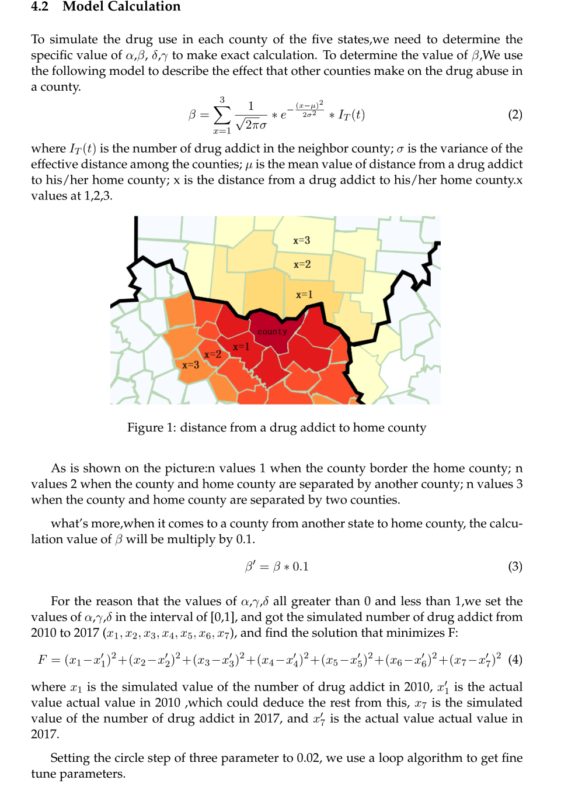

*Note: This is only a quick preview of our report. For more detail, if you are interested in this work, please contact waynemaibutterfly@gmail.com for the full report.*

Introduction
============

Background
----------

It is a serious problem that the abuse of synthetic and non-synthetic
opioid have become a crisis to the public health and economic
development.Further,health cost and assisted living facility staffing
will also be affected by the the increasing percentage of people with
opioid addiction within the elderly.The DEA/National Forensic Laboratory
Information System(NFLIS) published a data-heavy annual report
addressing on drug identification results and associated information
from drug cases analyzed by federal,state,and local forensic
laboratories,which handled over 88% of the nation's estimated 1.2
million annual state and local drug cases. Focusing on five
states:Ohio,Kentucky,West Virginia,Virginia,and Tennessee, we need to
analyse the trends of population on opioid using and identify a possible
strategy for countering the opioid crisis.

Restatement of the Problems
---------------------------

For part one: We are required to build a mathematical model to describe
the spread and characteristics of the reported synthetic opioid and
heroin incidents in and between the five states and their counties over
time.For the counties where had not found the specific opioid use,we can
predict their developing trends and identify the possibility on the
beginning of opioid abuse,as well as when and where the drug
identification threshold levels occur.

For part two:We are required to modify our model to analyse the reason
for the overuse of opioid with concluding important factors on drug
abusing from part one such as social circumstance, economic condition
and so on.Besides, we need to find out which group of people overuse the
drug which contribute to the increasing percentage of drugster.

For part three: Combining the results of part one and part two,we can
identify a possible strategy for countering the opioid crisis. Tested by
the model we built, we need to analyse the effectiveness of the strategy
and the sensitivity of our model.

Assumption and Justification
============================

-   The total number of people in each county is the same. Each non-drug
    user has the same possibility to addict drug.

-   The initial number of mild drug addict in each county of five states
    is 0.

-   The mild drug people will have a high probability of taking drugs
    again.

-   Compared to the rate that drug spread in the same county, the rate
    that drug spread among different county is one-tenth of that in the
    same county.

-   The distance between the position of a person to the center position
    of his/her home county obey a normal distribution with a mean of 0
    and a variance of $\sigma$ .

